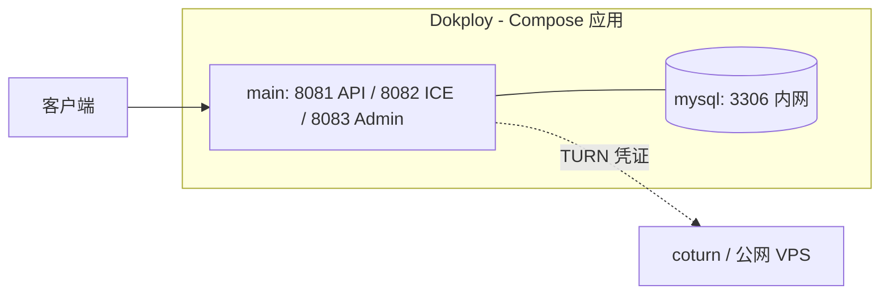

# Dokploy 部署指南

用 [Dokploy](https://docs.dokploy.com/docs/core/docker-compose) 的 **Compose / Stack** 部署 Mine Monopoly 服务端（API + ICE + Admin 管理面板）。

- 服务端 + MySQL → **同一个 Dokploy Compose 应用**（两个容器）
- coturn（WebRTC 中继）→ 同一台 VPS 或另一台，用 [docker/coturn/](../docker/coturn/README.md) 单独部署



---

## 0. 前置：镜像已构建并公开

Compose 里用的是 GHCR 镜像 `ghcr.io/okysu/mine-monopoly-server:latest`。确认它已经构建好并且**是公开的**：

```bash
docker pull ghcr.io/okysu/mine-monopoly-server:latest
```

如果拉不下来，说明包还是私有：GitHub → 头像 → **Your packages** → `mine-monopoly-server` → **Package settings** → **Change visibility → Public**。

> 镜像还没构建过？仓库 **Actions → Docker Image → Run workflow**。

---

## 1. 创建 Compose 服务

Dokploy → 你的项目 → **Create Service → Compose**

| 字段 | 值 |
| --- | --- |
| Name | `mine-monopoly`（随意） |
| Source Type | **Git**（推荐）或 **Raw** |
| Repository | 你的 fork，例如 `Okysu/mine-monopoly` |
| Branch | `main` |
| Compose Path | `docker-compose.dokploy.yml` |

用 **Git** 的好处：以后改了 compose 直接 push 就能重新部署。

不想连仓库就选 **Raw**，把 [`docker-compose.dokploy.yml`](../docker-compose.dokploy.yml) 的内容整段粘进编辑器。

> Compose 用 `image:` 拉取预构建镜像，**不需要 Dokploy 构建**，所以 Source 用 Git 也不会触发构建，几十秒就能起来。

---

## 2. 填环境变量

Dokploy 的 **Environment** 标签页里填。

⚠️ 关键机制：Dokploy 把这些变量**只写进 compose 同目录的 `.env` 文件，不会自动注入容器**。所以 `docker-compose.dokploy.yml` 里每一项都写成了 `${VAR:-默认值}` 显式引用。你在 UI 里改了值，compose 插值就会用你的值。

**必须改的：**

| 变量 | 说明 |
| --- | --- |
| `MONOPOLY_DOMAIN` | 你的服务器公网 IP 或域名，**不带协议和端口** |
| `MYSQL_PASSWORD` | 数据库密码，自己生成一个强的 |
| `MYSQL_ROOT_PASSWORD` | MySQL root 密码 |

**按需改的：**

| 变量 | 默认值 | 说明 |
| --- | --- | --- |
| `PROTOCOL` | `http` | 端口模式填 `http`；走 HTTPS 域名填 `https` |
| `TURN_URL` | `127.0.0.1` | coturn 的公网 IP / 域名 |
| `TURN_SECRET` | `change-me-turn-secret` | 必须和 coturn 的 `TURN_SECRET` 一致 |
| `MAP_ENCRYPT_KEY` | `ChangeMe16Char!!` | **必须 16 位 ASCII 字符** |
| `API_BASE_PREFIX` | 空 | 只有 HTTPS 域名模式才填，见第 4 节 |
| `ICE_BASE_PREFIX` | 空 | 同上 |
| `COTURN_METRICS_URL` | `http://127.0.0.1:9641/metrics` | Admin 的 TURN 监控，不需要就随便填 |
| `IMAGE` | `ghcr.io/okysu/mine-monopoly-server:latest` | 想锁版本就改成 `:1.2.3` |

> 变量丢了也不会崩：compose 里都带了 `:-默认值`。但 `MONOPOLY_DOMAIN` 留着 `localhost` 的话 Admin 面板会请求不到 API。

---

## 3. 部署并访问（端口模式，最简单）

点 **Deploy**。日志里出现下面这些就成功了：

```
[entrypoint] MySQL mysql:3306 已就绪（第 1 次尝试）
 SERVER  INFO :  数据库连接成功
 SERVER  INFO :  API服务启动成功 8081端口
 SERVER  INFO :  Admin服务启动成功 8083端口
 SERVER  INFO :  ICE服务启动成功 8082端口
```

访问：

| 服务 | 地址 |
| --- | --- |
| Admin 管理面板 | `http://<服务器IP>:8083` |
| API 健康检查 | `http://<服务器IP>:8081/health`（返回 `OK`） |
| 联机信令 | `ws://<服务器IP>:8082` |

环境变量对应 `PROTOCOL=http` + `MONOPOLY_DOMAIN=<服务器IP>`。

⚠️ 记得在**云厂商安全组**和系统防火墙放行 `8081`、`8082`、`8083` 三个 TCP 端口。Dokploy 自己只占 80/443/3000。

---

## 4. 可选：域名 + HTTPS（Dokploy Domains）

想要 HTTPS 就必须走**路径前缀模式**，因为服务端在没有前缀时会生成带 `:端口` 的 URL，而 Traefik 只监听 443。

### 4.1 改环境变量

| 变量 | 值 |
| --- | --- |
| `PROTOCOL` | `https` |
| `MONOPOLY_DOMAIN` | `monopoly.example.com` |
| `API_BASE_PREFIX` | `/monopoly-server` |
| `ICE_BASE_PREFIX` | `/monopoly-ice` |
| `ADMIN_BASE_PREFIX` | 留空 |

### 4.2 在 Domains 标签页加 3 条

Dokploy 的 Domain 支持 **Path + Strip Path**，正好用来把前缀剥掉：

| Host | Path | Strip Path | Container Port | HTTPS |
| --- | --- | --- | --- | --- |
| `monopoly.example.com` | `/monopoly-server` | ✅ 开 | `8081` | ✅ |
| `monopoly.example.com` | `/monopoly-ice` | ✅ 开 | `8082` | ✅ |
| `monopoly.example.com` | `/` | ❌ 关 | `8083` | ✅ |

原理（对应 `apps/server` 与客户端 `global.config.ts`）：

- 客户端请求 `https://域名/monopoly-server/user/login` → Traefik 剥掉 `/monopoly-server` → 容器收到 `/user/login` ✓
- PeerJS 客户端用 `path=/monopoly-ice` 连 `https://域名:443/monopoly-ice/peerjs/id` → 剥掉前缀 → 容器收到 `/peerjs/id`（PeerJS 服务端默认 path 就是 `/`）✓
- Admin 面板走 `/` 到 8083，静态资源是相对路径，`/env.js` 也在根路径 ✓

> **Docker Compose 改域名后必须重新 Deploy**，Dokploy 对 Compose 是靠 Docker labels 配 Traefik 的，没有热重载（Application 类型才有）。

### 4.3 部署后检查

用 **Preview Compose** 按钮看一眼最终 compose，确认 `main` 同时挂着 `monopoly` 和 `dokploy-network` 两个网络。如果只剩 `dokploy-network`，`main` 就连不上 `mysql` 了 —— 把 compose 里 mysql 的 `networks` 改成和 main 一致，或给 mysql 也加上 `dokploy-network`（`external: true`）。

---

## 5. 数据持久化与备份

`docker-compose.dokploy.yml` 用的是两个**命名卷**：

| 卷 | 容器路径 | 内容 |
| --- | --- | --- |
| `monopoly-public` | `/app/public` | 头像、地图、日志 |
| `mysql-data` | `/var/lib/mysql` | 数据库 |

命名卷可以在 Dokploy 的 **Volume Backups** 里配 S3 自动备份。

> 别改成绝对路径的 bind mount —— Dokploy 每次部署会清掉。要用 bind mount 必须写成 `../files/xxx`。

---

## 6. ⚠️ 客户端必须用匹配的配置重新构建

这是自建服务器最容易踩的坑：**客户端（网页版 / Electron / Android）的服务器地址是构建时写死的**，客户端里没有「切换服务器」的设置项，官方发布的客户端只能连 `fatpaper.site`。

所以要跑自己的服务器，必须自己构建客户端，让它指向你的 Dokploy 地址。仓库的 `release.yml` 读的是 GitHub 仓库的 **Variables**，你在 **Settings → Secrets and variables → Actions → Variables** 里改这几个：

| Variable | 端口模式 | HTTPS 域名模式 |
| --- | --- | --- |
| `MONOPOLY_DOMAIN` | 服务器 IP | `monopoly.example.com` |
| `PROTOCOL` | `http` | `https` |
| `SERVER_PORT` | `8081` | `8081` |
| `ICE_SERVER_PORT` | `8082` | `8082` |
| `API_BASE_PREFIX` | 空 | `/monopoly-server` |
| `ICE_BASE_PREFIX` | 空 | `/monopoly-ice` |
| `MONOPOLY_ADMIN_PORT` | `8083` | `8083` |

然后打一个 `client-v*` tag 触发 `release.yml`，就会产出指向你服务器的 Electron 安装包 / APK / Web 包。

只想快速试一下的话，本地构建网页版最省事：

```bash
cp .env.example .env
# 编辑 .env 填上面的值
pnpm install
pnpm --filter @mine-monopoly/env run build
pnpm --filter @mine-monopoly/client run build:web
# 产物在 apps/client/dist/frontend
```

---

## 7. TURN（联机中继）

WebRTC 在对称 NAT / 严格网络下必须有 TURN。Dokploy 这台机器可以直接再开一个 Compose 应用跑 coturn，按 [docker/coturn/README.md](../docker/coturn/README.md) 来：

1. Dokploy → Create Service → Compose → Raw，粘贴 `docker/coturn/docker-compose.yml`
2. 环境变量填 `EXTERNAL_IP`（VPS 公网 IP）、`TURN_SECRET`、`TURN_REALM`
3. ⚠️ **网络模式必须是 host**（compose 里已经写了 `network_mode: host`），否则中继地址会变成容器内网地址
4. 安全组放行 `3478/udp`、`3478/tcp`、`49160-49200/udp`
5. 回到 monopoly 的 Environment，把 `TURN_URL` 填成这台机器的公网 IP、`TURN_SECRET` 填成同一个值，重新部署

> 端口细节和「为什么不能放在 RCA/K8s」见 [docker/coturn/README.md](../docker/coturn/README.md)。

---

## 8. 常见问题

**`main` 一直重启，日志停在「等待 MySQL」**

入口脚本最多等 300 秒（`DB_WAIT_TIMEOUT` 可调）。看 mysql 容器的日志确认它正常启动；密码不一致是最常见原因。

**`数据库连接失败` / `ECONNREFUSED mysql:3306`**

- `MYSQL_PASSWORD` 在 main 和 mysql 两边不一致（它们是同一个变量，一般不会）。
- 网络被 Dokploy 的 domain 配置改掉了 —— 见 4.3。
- MySQL 数据卷是用旧密码初始化的：改密码后**已初始化的卷不会同步**。要么删掉 `mysql-data` 卷重来（丢数据），要么改 `MYSQL_ROOT_PASSWORD` 用 root 登进去 `ALTER USER`。

**Admin 面板白屏 / 请求发到 localhost**

`MONOPOLY_DOMAIN` 还是默认的 `localhost`。改成实际地址后**重新 Deploy**。

**Admin 面板能打开，但接口 404**

用了 HTTPS 域名模式但 Traefik 没剥前缀（`Strip Path` 没开），或者 `API_BASE_PREFIX` 和 Domain 里的 Path 不一致。两者必须完全对应。

**图片/头像上传后显示不出来**

本地存储返回的 URL 用 `PROTOCOL://MONOPOLY_DOMAIN:PORT/static/...` 拼接。域名模式下确认 `PROTOCOL=https`、`MONOPOLY_DOMAIN` 是域名、`API_BASE_PREFIX` 与 Domain Path 一致。

**TURN 监控报错**

`COTURN_METRICS_URL` 指向的 9641 不可达。只影响监控展示，不影响联机。

**重启后所有人掉登录**

服务端 RSA 签名密钥是进程启动时随机生成的（`apps/server/src/utils/rsaKey.ts`），重启即失效。单副本自建场景问题不大，别频繁重启。

---

## 相关文件

| 文件 | 作用 |
| --- | --- |
| `docker-compose.dokploy.yml` | Dokploy Compose 部署定义（main + mysql） |
| `docker/Dockerfile` | 镜像定义（服务端 + Admin 面板） |
| `docker/entrypoint.sh` | 启动前等待 MySQL、初始化目录 |
| `.github/workflows/docker-image.yml` | 构建并推送镜像到 GHCR |
| `docker/coturn/` | coturn 独立部署（VPS / Dokploy / 宝塔） |
| `docs/rainyun-deploy.md` | 雨云 RCA 部署指南（另一条路线） |
